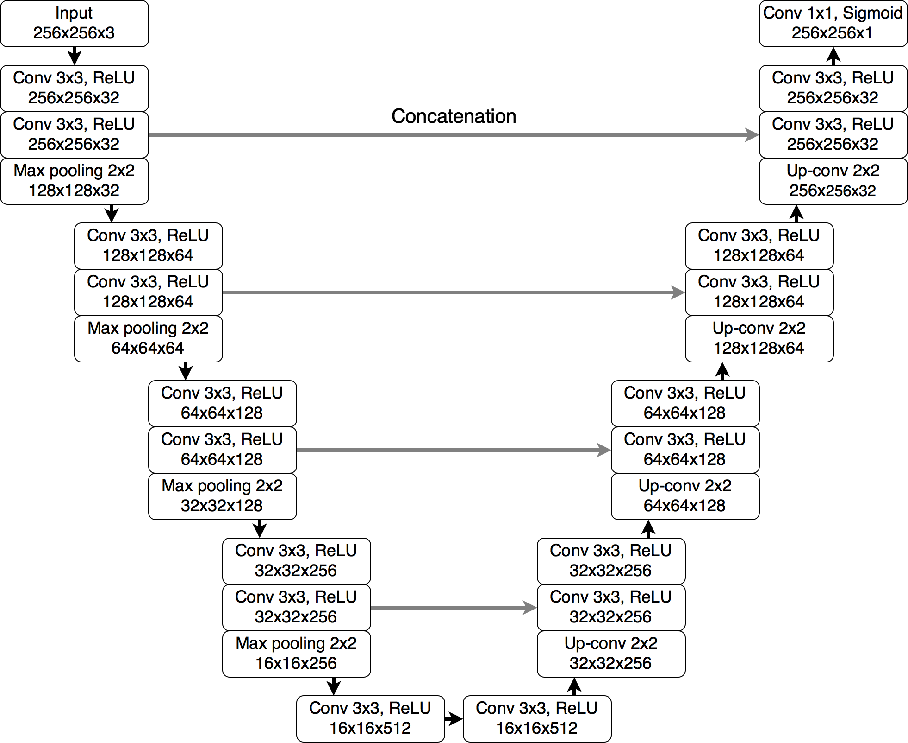
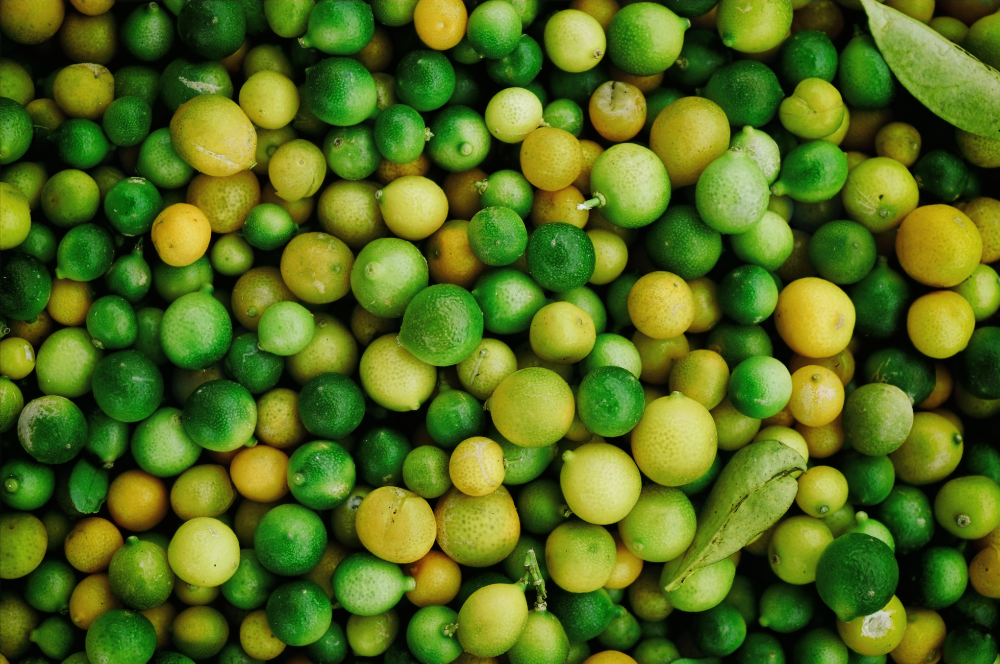
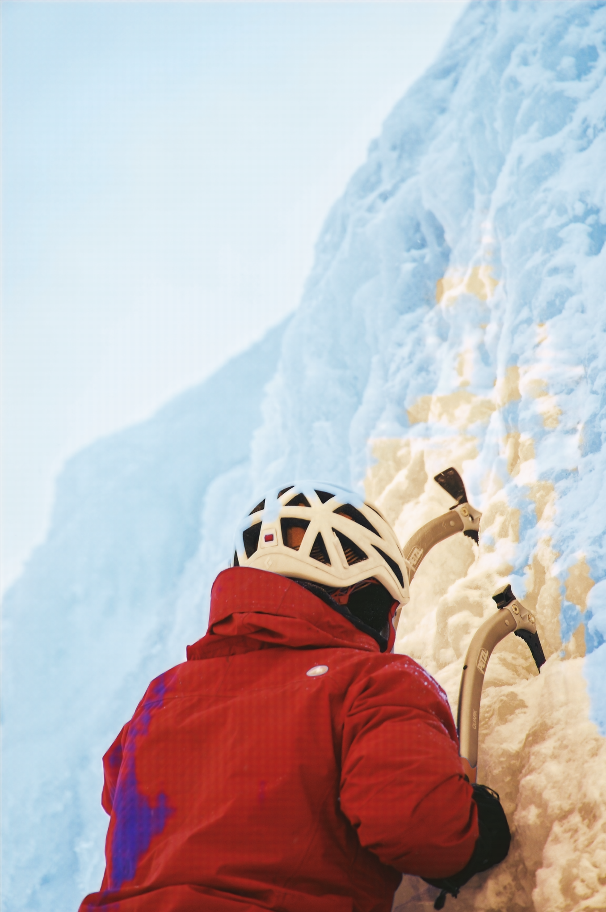
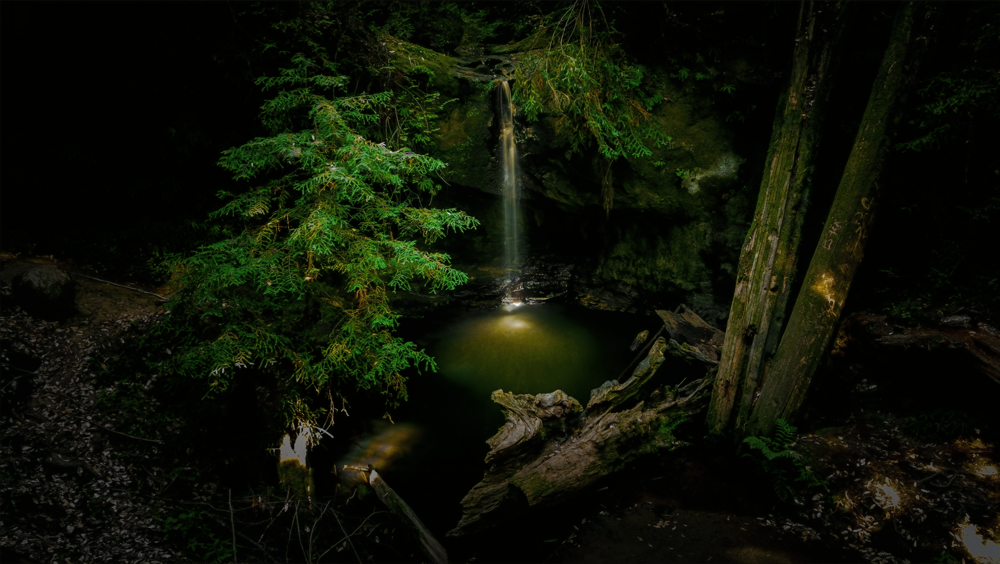
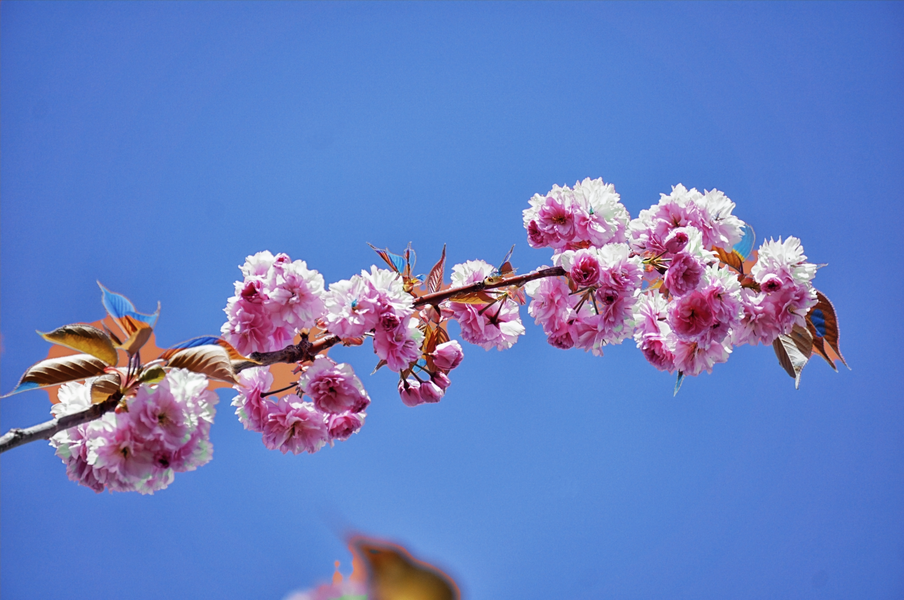

# Signal Processing Research

This repository serves as a personal backup of my signal processing research.  
It includes initial models used for learning PyTorch and a more comprehensive project on image debayering using a U-Net.

---

## Repository Structure

The repository is organized into three main folders:

- **`Getting_Started/`** — Contains introductory PyTorch models.  
- **`Debayer_Project/Data/`** — Contains all scripts and data related to dataset creation and processing.  
- **`Debayer_Project/Model/`** — Contains the U-Net model, training, and validation scripts.

---

## Getting Started

The `Getting_Started` folder contains three image classification models built to learn PyTorch.  
The models and their final test accuracies are as follows:

| File         | Model                    | Dataset     | Test Accuracy |
|---------------|--------------------------|--------------|----------------|
| `mlp.py`      | Multi-Layer Perceptron   | FashionMNIST | 87.7%          |
| `cnn.py`      | Convolutional Neural Net | CIFAR-10     | 61.4%          |
| `resnet.py`   | ResNet                   | CIFAR-10     | 90.1%          |

---

## Debayer Project

This project implements a **U-Net model** to perform image debayering (demosaicing).

---

### Data Pipeline & Structure

The training data was generated from the **DIV2K Dataset**.  
The processing pipeline is as follows:

1. **Download:** The 800 high-resolution training images from the DIV2K dataset were downloaded.  
2. **Process:** A Bayer filter (BGGR/RGGB) was applied to each full-resolution image to create the *input* data.  
   The original image serves as the *target*.  
3. **Split:** Each full-size input/target pair was split into 100 smaller, equal-sized patches to create a dataset suitable for training.  
4. **Total Dataset:** This process resulted in **80,000 image pairs** (800 images × 100 patches).

The final dataset is organized into *Train* and *Validate* folders as follows:
```
Final_Dataset_Images/
│
├── Train/
│ ├── Input/ # Bayer-pattern image patches for training
│ └── Target/ # Full-color (ground truth) patches for training
│
└── Validate/
├── Input/ # Bayer-pattern image patches for validation
└── Target/ # Full-color (ground truth) patches for validation
```

The **`make_dataset.py`** file contains the custom PyTorch `Dataset` class used by the data loaders.

---

### Model & Training

The model, defined in **`unet.py`**, is a **U-Net architecture** — a structure well-suited for image-to-image translation tasks like debayering. This model is based off a U-Net model used for brain MRI and has the following structure:

<p align="center">
  
</p>

- **`main.py`** handles training and validation loops, saving model checkpoints.
- The model learns to reconstruct RGB images from single-channel Bayer inputs.

---

### V4 Training Results (250 epochs)

| Epoch | Validation Avg Loss |
|--------|----------------------|
| 1      | 0.007502             |
| 20     | 0.000284             |
| 200    | 0.000130             |
| 250    | 0.000127             |

This decreasing loss indicates the model is learning.  
Visual confirmation of the output can be generated using **`visual.py`**.

---

### Validation & Current Status

**V1 ran for 4 generations as a proof-of-concept, conclusions below:**

The model is learning, but the visual results show it struggles with the red and blue channels.  
This may be due to a mismatch between the Bayer pattern used during data creation (e.g., **BGGR**) and the one expected by the model (e.g., **RGGB**).

| Epoch | Validation Avg Loss |
|--------|----------------------|
| 1      | 0.043694             |
| 50     | 0.004773             |
| 100    | 0.003152             |
| 250    | 0.002359             |

Additionally, the Avg Loss indicated that the model is doing better than it really is, as evidenced by the visual results.
Therefore, modifying how loss is calculated, or modifying training data so that all training images contain a variety of colors might be necessary. For example, weighting loss so that large mismatches impact the loss much greater may be a good idea.

**V2 is identical to V1 except it ran for full 250 generations, conclusions below:**

The model learned, but results still shows it struggles with red and blue channels. This is especially apparent for image `0898v2.png`, where the flower itself is color-accurate but the sky is completely orange. However, the model exceeds with green colors and textures, as evidenced by `0802v2.png`.

Additionally, there is the issue that the images retain a slight mosaic when zoomed in, where it is clear that there was a pattern before the images were colored, so the model is not interpolating successfully.

Similar to V1, the loss for V2 is extremely low, which is odd, as the images are far from perfect (While not recorded, the loss for the later epochs was around 0.0002, suggesting a 10x improvement compared to V1).

**V3 aimed to remove BGGR/RGGB error from V1/V2 as well as oversaturation:**

Used the `nn.sigmoid` function to squash the values output by the model, which would have range [-∞,+∞] into [0,1] for the tensor to then represent as [0,255]. Additionally, changed how dataset was generated by changing bayer pattern from OpenCV's native **BGGR** to **RGGB**, as the target image uses **RGB** color.

The results after 250 generations were catastrophic, with images exhibiting the same problems as V2 is not worse (for full comparison see the images in the image folder).

However, this is likely not due to issues with the model but with how the dataset is being generated, which is probably leading to massive overfit.

| Epoch | Validation Avg Loss |
|--------|----------------------|
| 1      | 0.007502             |
| 20     | 0.000284             |
| 200    | 0.000130             |
| 250    | 0.000127             |

The Avg Validation loss suggests mathematical near perfection, however, the visual results suggest otherwise. Such a low validation loss is a symptom of overfit, which is likely occuring because the images the model is recieving are both small and not random.

The train/validation datasets are being generated by splitting the image into 100 chunks, so the model will 'see' the entire image except not all at once. This results in biasing, where the model learns what to do in solid color images (ie. the sky or grass) and will likely see many more images of one color rather than both.

**V4 and V5 tackle the overfit by using `RandomCrop` transform:**

In order to correct for the overfitting, the way the training/validation data is being generated was changed. First, image size was increased from 256x256 pixels (due to buffer, actual image smaller) to 512x512 pixels, as this increases the amount of information the model sees. More importantly, instead of uniformly splitting each image from the DIV2K dataset, each epoch uses the `RandomCrop` transform, which ensures that the model sees different images each epoch.

This results in the training/validating datasets being reduced 100x from 80,000 and 10,000 images respectively to 800 and 100 images/epoch. However, the 800 images will always be unique due to how they are cropped in a different way every time, and it is likely that they will contain edges and transitions from one shade to another, meaning the model should learn how to demosiac and not the dataset. Therefore, each epoch now sees 100x less images, meaning for the same amount of training as previous iterations, 25,000 epochs are necessary.

Additionally, the validation images are now always a 512x512 pixel center crop, meaning the subject is more likely to be in the frame, and not noise from the outer parts of the image (which resembles the training data hence low loss for both training and validating).

V4 was a 250 epoch test run with the following avg loss (for full loss list, view loss_v4.csv):

| Epoch | Validation Avg Loss |
|--------|----------------------|
| 1      | 0.043694             |
| 50     | 0.004773             |
| 100    | 0.003152             |
| 250    | 0.002359             |

The loss is significanly higher than for V1-V3, however, the V4 images are considerably better than previous generations, even the V2 images (for which the model was trained on 100x more images). This is a tremendous success and indicates that the loss function now reflects the actual images being generated. V5 is the exact same as V4, except this time, ran for the full 25,000 epochs (with validation being run every 10th epoch to save compute time).

In spite of the success, there are still ways to improve:

The model still exhibits difficulties in accurately rendering the blue channel and maintaining consistent  color temperature. The blue sky often appears desaturated or orange (`0898v4.jpg`), and color balance issues persist in complex, low-light areas (e.g., cityscape in `0873v4.jpg`, penguin rocks in `0801v4.jpg`). This may be fixed after training for the full 25,000 epochs, as the avg loss was still trending towards a minimum.

Additionally, there is significant detail loss in dark areas, which is especially present in `0852v4.png` (see top left corner). This is likely to do with how MSE loss doesn't punish small differences in color, which is exacty what occurs in such dark environments. The same MSE weakness arises when considering that the model still shows, albeit significantly less, the underlying mosaic (0802v4.png, 0801v4.png). A possible improvement for these issues might involve a combination of MSELoss with a different, more perceptual, loss function.

V5 showed a the model was still overfitting, but on the more traditional way. After 3,500 epochs, training loss was around an order of magnitude smaller than the validation loss (training loss [~0.0004, ~0.0001], validation loss ~0.002). Additionally, validation loss had no significant change when compared to V4, so the training process was killed (hence no complete loss list).

**V6, V7, V7 additional overfit and loss fn improvements:**

V6 targets overfit in two ways: Added nn.dropout(0.25) at bottleneck layer and improved dataset generation by adding random horizontal and vertical flips.

Additionally V6 changed the loss function to L1Loss instead of MSE loss with hopes of minimizing the model crushing the dark colors and to produce a sharper image.

Epoch size was also tweaked to optimize for minimal GPU downtime: artificially increased training dataset by 10x so each epoch goes through 8,000 images instead of 800. Thus total epochs decreased back to 250 (not 2,500 because the significantly larger 512x512px images are around 10x larger than old images, wanted to keep training time similar at around 12 hours).

Results were disappointing, with the loss funciton showing much less loss than was actually visible on large images. It was incredibly frustrating to see that the model was not learning and was making the same mistakes as before (blue/orange color swap, red/purple swap). 

V7 and V7.5 represent a series of changes with the hopes of tackling all underlying issues. The two greatest improvements were: fixing how the bayer images were generated, this time by opting out of using openCV libraries and going with PIL, which natively opens images in RGB format. The second was providing more information to the model (dataset.py) by taking the single-channel PIL 'L' image and unpacking it into 4 channels to split the R, G, B pixel intensities into each channel.

This way, the model shouldn't have to learn what pixel color it is seeing, as it is provided with that information.

| Epoch | Validation Avg Loss |
|--------|----------------------|
| 1      | 0.084605             |
| 10     | 0.070043             |
| 20     | 0.063610             |
| 25     | 0.062039             |

The model ran for a preliminary 25 epochs, and in spite of the avg loss suggesting more errors, the images looked better, suggesting that the model was finally learning and on the right track. However, there was still overfit (validation vs training discrepancies, where validation loss was around 0.06 and training around 0.02).

**V8: Charbonnier Gradient Loss**


---

### Current Visual Results

The **`visual.py`** script is used to test the trained model on a full-sized validation image from the `DIV2K_Valid_Bayer` folder. 

It runs the model on the large image and saves the resulting debayered output.

Below is a side-by-side comparison of a ground truth (target) image and the corresponding output from the latest trained model.

For more images, and a version history of heach image, see images folder or the IMAGES.md file within the images folder.

| Ground Truth | Model Output |
|---------------|--------------|
|  |  |
|  |  |
|  |  |
|  |  |
|  |  |
|  |  |

---

**Author:** Bernardo Lozano  
**Frameworks Used:** PyTorch, NumPy, OpenCV  
**Dataset:** DIV2K
