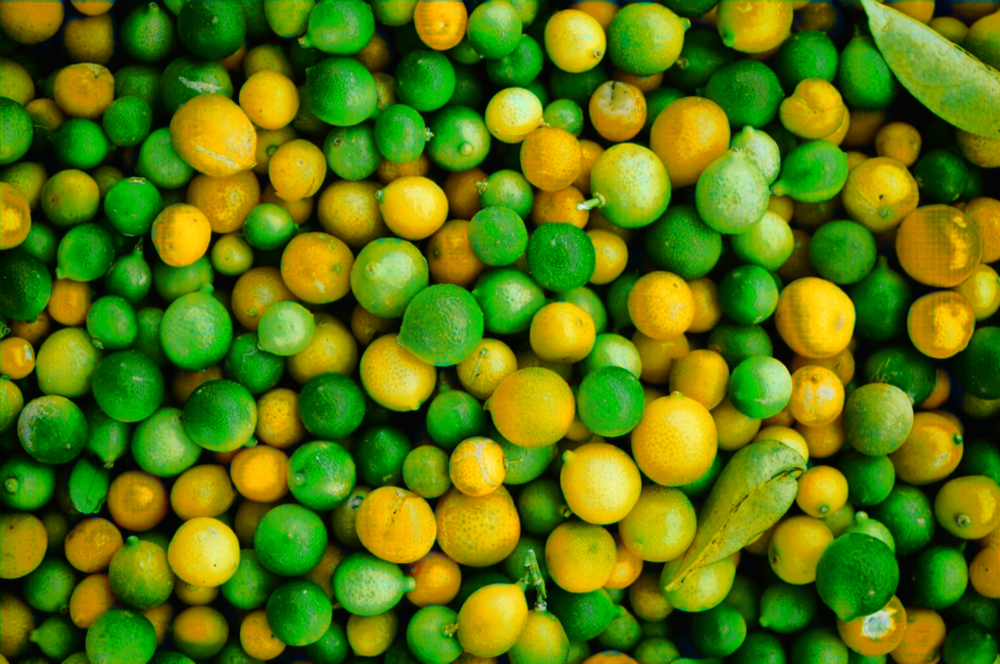
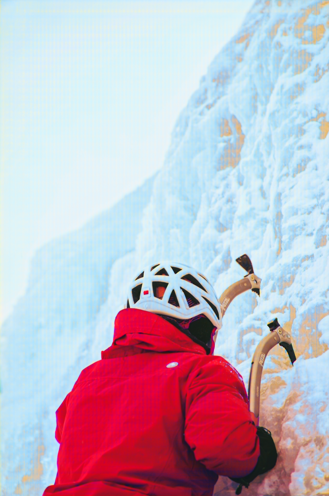
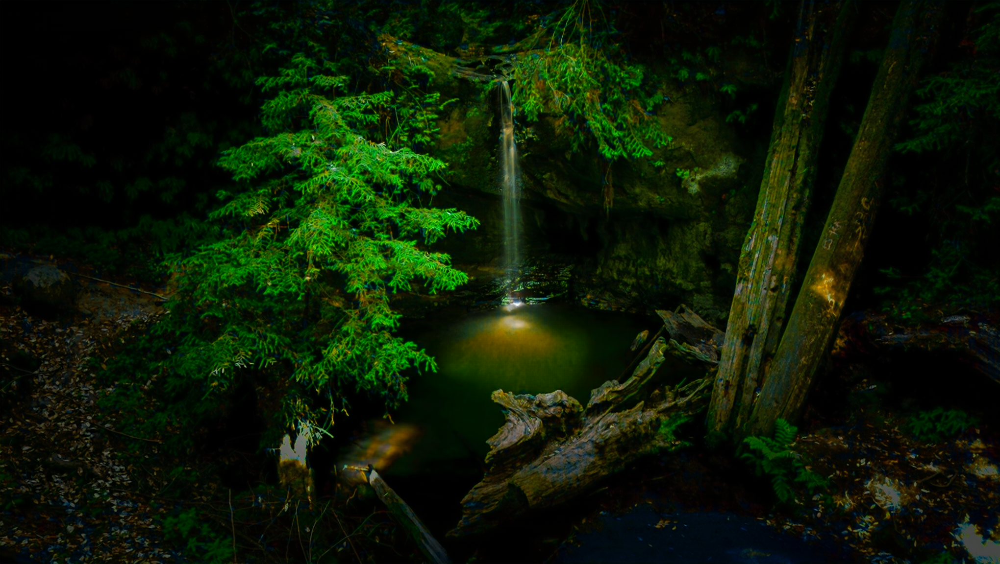

# Signal Processing Research

This repository serves as a personal backup of my signal processing research.  
It includes initial models used for learning PyTorch and a more comprehensive project on image debayering using a U-Net.

---

## Repository Structure

The repository is organized into three main folders:

- **`Getting_Started/`** — Contains introductory PyTorch models.  
- **`Debayer_Project/Data/`** — Contains all scripts and data related to dataset creation and processing.  
- **`Debayer_Project/Model/`** — Contains the U-Net model, training, and validation scripts.

---

## Getting Started

The `Getting_Started` folder contains three image classification models built to learn PyTorch.  
The models and their final test accuracies are as follows:

| File         | Model                    | Dataset     | Test Accuracy |
|---------------|--------------------------|--------------|----------------|
| `mlp.py`      | Multi-Layer Perceptron   | FashionMNIST | 87.7%          |
| `cnn.py`      | Convolutional Neural Net | CIFAR-10     | 61.4%          |
| `resnet.py`   | ResNet                   | CIFAR-10     | 90.1%          |

---

## Debayer Project

This project implements a **U-Net model** to perform image debayering (demosaicing).

---

### Data Pipeline & Structure

The training data was generated from the **DIV2K Dataset**.  
The processing pipeline is as follows:

1. **Download:** The 800 high-resolution training images from the DIV2K dataset were downloaded.  
2. **Process:** A Bayer filter (BGGR/RGGB) was applied to each full-resolution image to create the *input* data.  
   The original image serves as the *target*.  
3. **Split:** Each full-size input/target pair was split into 100 smaller, equal-sized patches to create a dataset suitable for training.  
4. **Total Dataset:** This process resulted in **80,000 image pairs** (800 images × 100 patches).

The final dataset is organized into *Train* and *Validate* folders as follows:
```
Final_Dataset_Images/
│
├── Train/
│ ├── Input/ # Bayer-pattern image patches for training
│ └── Target/ # Full-color (ground truth) patches for training
│
└── Validate/
├── Input/ # Bayer-pattern image patches for validation
└── Target/ # Full-color (ground truth) patches for validation
```

The **`make_dataset.py`** file contains the custom PyTorch `Dataset` class used by the data loaders.

---

### Model & Training

The model, defined in **`unet.py`**, is a **U-Net architecture** — a structure well-suited for image-to-image translation tasks like debayering. This model is based off a U-Net model used for brain MRI and has the following structure:


- **`main.py`** handles training and validation loops, saving model checkpoints.
- The model learns to reconstruct RGB images from single-channel Bayer inputs.

---

### Initial Training Results

A preliminary 4-epoch test was run to verify that the model was learning correctly.  
The validation loss decreased consistently, confirming learning progress:

| Epoch | Validation Avg Loss |
|--------|----------------------|
| 1      | 0.007502             |
| 2      | 0.006270             |
| 3      | 0.002309             |
| 4      | 0.001356             |

This decreasing loss indicates the model is learning.  
Visual confirmation of the output can be generated using **`visual.py`**.

---

### Validation & Current Status

The **`valid.py`** script is used to test the trained model on a full-sized validation image from the `DIV2K_Valid_Bayer` folder.  
It runs the model on the large image and saves the resulting debayered output.

**Current Status:**  
The model is learning, but the visual results show it struggles with the red and blue channels.  
This may be due to a mismatch between the Bayer pattern used during data creation (e.g., **BGGR**) and the one expected by the model (e.g., **RGGB**).

Additionally, the Avg Loss indicated that the model is doing better than it really is, as evidenced by the visual results.
Therefore, modifying how loss is calculated, or modifying training data so that all training images contain a variety of colors might be necessary. For example, weighting loss so that large mismatches impact the loss much greater may be a good idea.

---

### Visual Results

Below is a side-by-side comparison of a ground truth (target) image and the corresponding output from the trained model (200 epochs).

| Ground Truth | Model Output |
|---------------|--------------|
|  |  |
|  |  |
|  |  |
|  |  |
|  |  |
|  |  |

---

**Author:** Bernardo Lozano  
**Frameworks Used:** PyTorch, NumPy, OpenCV  
**Dataset:** DIV2K
