# Signal Processing Research - Demosaicing

This repository serves as a personal backup of my signal processing research. It documents my progression from introductory models used for learning PyTorch to a comprehensive image debayering (demosaicing) project using U-Net and RCAN architectures.

This file contains a summary of the entire process, along with comparisons of the final models. For a much more detailed explanation, view `Version History.md`. 

---

## Getting Started: PyTorch Tutorials

The `Getting_Started` folder serves as an important foundational tutorial for understanding neural networks and the PyTorch framework. It contains three core image classification models that were instrumental in the learning process:

| File         | Model                    | Dataset     | Test Accuracy |
|--------------|--------------------------|-------------|---------------|
| `mlp.py`     | Multi-Layer Perceptron   | FashionMNIST| 87.7% |
| `cnn.py`     | Convolutional Neural Net | CIFAR-10    | 61.4% |
| `resnet.py`  | ResNet                   | CIFAR-10    | 90.1% |

---

## Debayer Project Overview

The core of this repository focuses on reconstructing full-color RGB images from single-channel Bayer pattern (RGGB) inputs. The models were trained and validated using 80,000 image pairs generated from 800 high-resolution images from the DIV2K dataset.

### The Learning Journey: From V1 to V11

Developing this pipeline required significant iteration to overcome issues like overfitting, dataset biases, and loss function limitations. Key milestones in the version history include:

* **Data Representation is Crucial (V1-V7.5):** Early models (V1-V3) suffered from massive overfit and color channel confusion (e.g., swapped red and blue channels). This was fixed by abandoning OpenCV's native BGGR in favor of PIL's native RGB handling, and more importantly, unpacking the single-channel image into 4 distinct channels so the model didn't have to guess the bayer pattern.
* **Defeating Overfit via Augmentation (V4-V5):** Transitioning from static image chunks to a `RandomCrop` transform, combined with random horizontal and vertical flips, forced the model to learn actual demosaicing features rather than memorizing the training set's solid colors.
* **Refining the Loss Function (V9.1-V10):** Standard MSE loss caused the model to smooth out high-frequency textures and crush dark colors. Moving to a differentiable L1 loss (Charbonnier) drastically reduced artifacting. Ultimately, combining Charbonnier with Perceptual (VGG) and Edge (Sobel) loss functions successfully preserved granular details.
* **Optimizing Hardware Bottlenecks (V10):** Preloading the entire dataset into RAM eliminated a massive I/O bottleneck, making it feasible to train the optimized model for a full 250 epochs.

---

## Model Performance: U-Net (V10) vs. RCAN (V11)

The final iterations evaluated a highly optimized U-Net (V10) against a newly implemented RCAN architecture (V11). Both models were benchmarked against OpenCV's baseline demosaicking on the Kodak Image Dataset.

### Version 10: Optimized U-Net
Version 10 utilizes the U-Net architecture paired with the combined Charbonnier, Perceptual, and Edge loss function. 

| Metric | Result |
|--------|--------|
| OpenCV PSNR | 29.12 dB |
| My Model PSNR | 38.04 dB |
| My Model SSIM | 0.9810 |
| Improvement | +8.92 dB |

  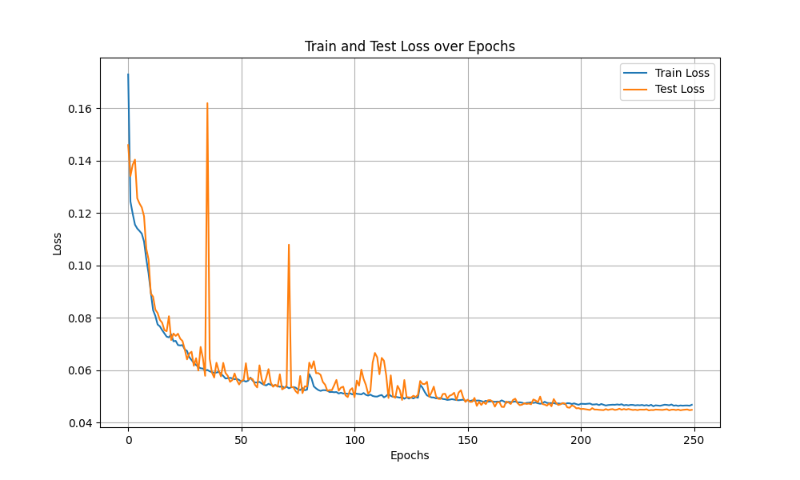

### Version 11: RCAN Architecture
Version 11 swapped out the U-Net for an RCAN model, achieving the highest performance metrics of the project.

| Metric | Results |
|--------|---------|
| OpenCV Baseline PSNR | 29.12 dB |
| My Model PSNR | 41.45 dB |
| My Model SSIM | 0.9883 |
| PSNR Improvement | +12.33 dB |

  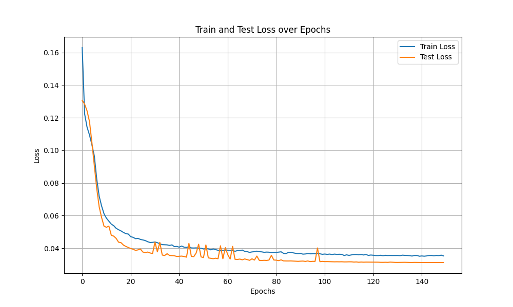

---

## Visual Results: 64px Center Crops

The comparisons below feature 64x64px center crops to highlight the granular detail and high-frequency texture preservation between the V10 (U-Net) and V11 (RCAN) models. 

| V10 (U-Net) Model Output (Ground Truth, Left, Output, Right)| V11 (RCAN) Model Output (Ground Truth, Left, Output, Right)|
|--------------------------|-------------------------|
| 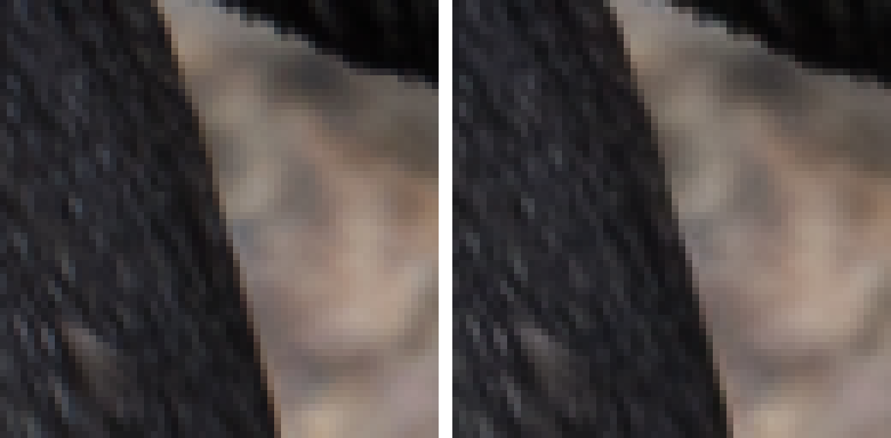 | 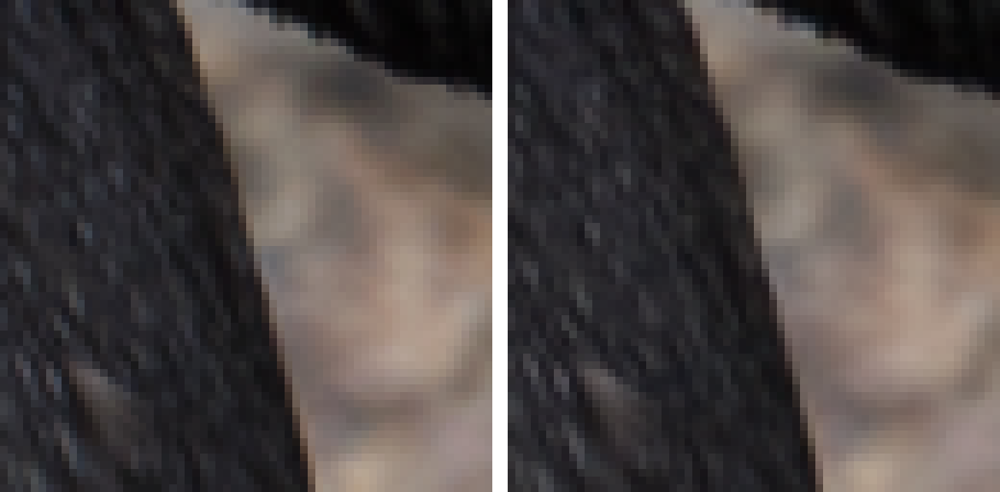 |
| 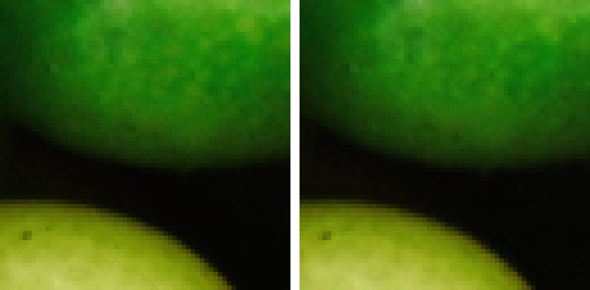 |  | 
| 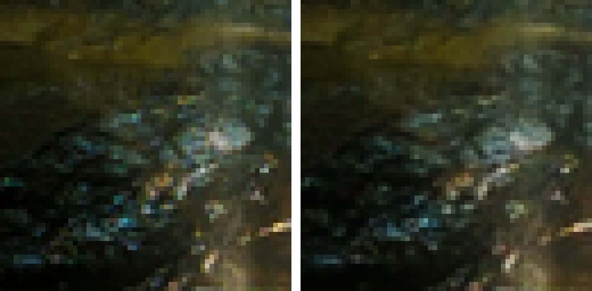 | 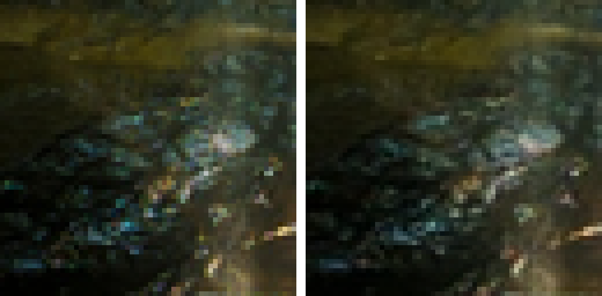 |
| 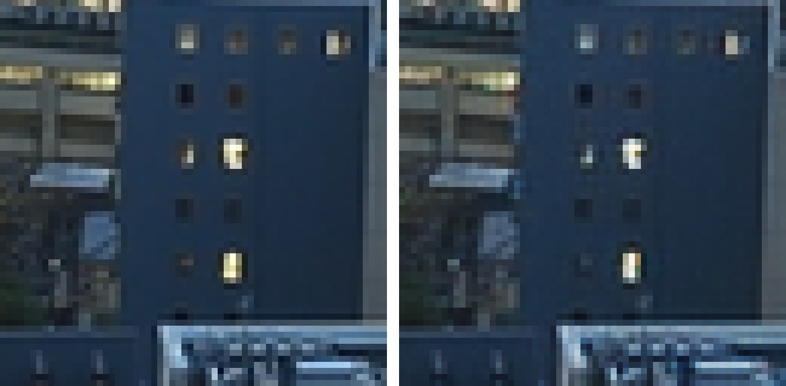 | 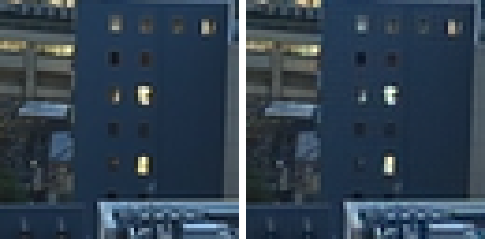 |
| 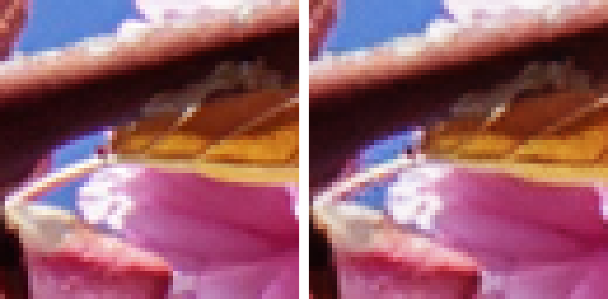 | 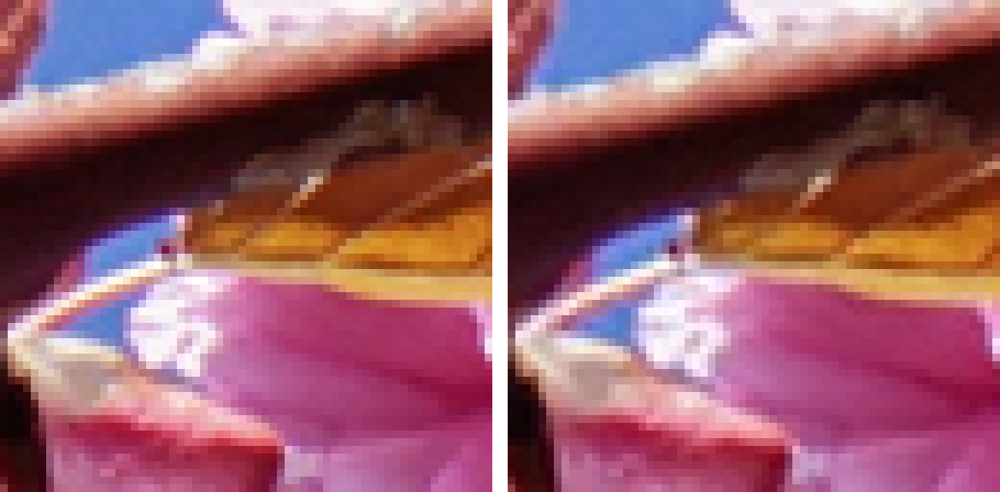 |